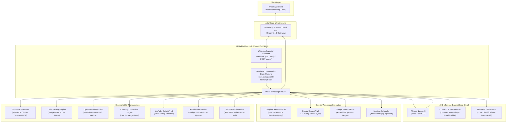

<div align="center">

# 🤖 AI Buddy WA — Multimodal Autonomous WhatsApp Assistant & Microservice Swarm

**Next-Generation Conversational AI Assistant, Voice Intelligence, Google Workspace Automation & Real-Time Utility Swarm**

[](https://github.com/nleelaranga-ai/AI_Buddy_WA)
[](https://www.python.org)
[](https://developers.facebook.com/docs/whatsapp/cloud-api)
[](https://groq.com)
[](https://groq.com)
[](https://developers.google.com/workspace)
[](LICENSE)

<br />

</div>

---

## 📑 Executive Summary

Everyday digital workflows are plagued by **app-switching fatigue** and context fragmentation. Users routinely toggle between separate applications for calendar scheduling, cloud storage, spreadsheet expense tracking, document format conversions, language translation, email drafting, live transit tracking, and weather forecasts.

**AI Buddy WA** unifies these disparate utilities into a single, seamless conversational interface directly within **WhatsApp**—leveraging the **WhatsApp Business Cloud API (Graph v24.0)** and ultra-low-latency LLM inference via **Groq Cloud** (`llama-3.3-70b-versatile`, `llama-3.1-8b-instant`, and `whisper-large-v3`). 

By bridging edge voice notes, Google Workspace APIs, OCR computer vision, and external REST microservices through an intelligent state-machine dispatcher, AI Buddy transforms WhatsApp from a simple chat app into an **autonomous personal operating system**.

---

## 🎯 Core Architectural Challenges & Solutions

* **Sub-Second Webhook Responsiveness**: WhatsApp requires immediate $200\text{ OK}$ webhook acknowledgments to prevent automated message retries. The architecture separates ingestion, background task queuing (APScheduler), and asynchronous external API dispatches.
* **Voice Note Ingestion & Transcoding**: WhatsApp delivers audio as Opus-encoded `audio/ogg`. AI Buddy features an automated MIME-normalization pipeline that dynamically packages audio streams for Groq's `whisper-large-v3` API with sub-800ms transcription latency.
* **Multi-User Conflict-Free Calendar Scheduling**: Rather than relying on simple calendar inserts, the system implements an **interval-merging FreeBusy algorithm** across multiple attendee calendars to detect optimal mutual free slots.
* **Resilient Transit Telemetry**: Indian Railways PNR lookups often suffer from high upstream downtime. AI Buddy implements a **3-Layer Fallback Matrix** (Presentation Demo Gate $\rightarrow$ RapidAPI Live Query $\rightarrow$ Synthetic Heuristic Fallback).

---

## 🏛️ System Architecture & Data Flow



---

## 🧮 Algorithmic & Mathematical Formulations

### 1. Multi-Attendee Interval-Merging FreeBusy Scheduling Algorithm

When finding a common free meeting slot among $N$ attendees within a search horizon $[T_{\text{start}}, T_{\text{end}}]$, each attendee's calendar yields a set of busy intervals $B_k = \{[s_{k,1}, e_{k,1}], [s_{k,2}, e_{k,2}], \dots\}$.

1. **Union of Busy Intervals**:
   $$B_{\text{all}} = \bigcup_{k=1}^N B_k$$

2. **Sorting & Merging Overlaps**:
   Sort $B_{\text{all}}$ such that $s_i \le s_{i+1}$. Merge adjacent intervals $[s_i, e_i]$ and $[s_{i+1}, e_{i+1}]$ if:
   $$s_{i+1} < e_i \implies [s_{\text{merged}}, e_{\text{merged}}] = [s_i, \max(e_i, e_{i+1})]$$

3. **Free Slot Complement Search**:
   Given merged busy set $M = \{[s_1, e_1], [s_2, e_2], \dots, [s_m, e_m]\}$, candidate free windows $F_j = [e_{j}, s_{j+1}]$ are evaluated against requested meeting duration $D_{\text{meet}}$ and business hours $[H_{\text{open}}, H_{\text{close}}]$:
   $$\text{Valid}(F_j) = \begin{cases} \text{True} & \text{if } (s_{j+1} - e_j) \ge D_{\text{meet}} \land [e_j, s_{j+1}] \subseteq [H_{\text{open}}, H_{\text{close}}] \\ \text{False} & \text{otherwise} \end{cases}$$

### 2. 3-Layer Fault-Tolerant PNR Resolution Matrix

To guarantee zero-failure live presentations while supporting real-world passenger PNR queries:

$$\text{ResolvePNR}(P) = \begin{cases} 
\text{MockData}(P) & \text{if } P = P_{\text{demo}} \quad \text{(Layer 1: Instant Deterministic Gate)} \\
\text{RapidAPI}(P) & \text{if } \text{Key} \ne \emptyset \land \text{Status} = 200 \quad \text{(Layer 2: Real IRCTC REST Call)} \\
\text{HeuristicFallback}(P) & \text{otherwise} \quad \text{(Layer 3: Graceful Synthetic State)}
\end{cases}$$

---

## 🧩 Comprehensive Subsystem Breakdown

### 1. 🎙️ Voice Intelligence & Audio Transcription (`grok_ai.py`)
- Automatically intercepts WhatsApp voice notes (`audio/ogg; codecs=opus`).
- Dynamically normalizes upload headers and streams binaries directly to Groq's `whisper-large-v3` endpoint.
- Transcribed text is seamlessly injected into the natural language understanding pipeline as if typed by the user.

### 2. 🧠 Groq-Powered Dual-LLM Core (`grok_ai.py`)
- **`llama-3.3-70b-versatile`**: Executes complex reasoning, context-aware interactive email drafting with iterative question loops, and multi-turn conversational synthesis.
- **`llama-3.1-8b-instant`**: Executes instantaneous intent classification, date/time extraction, and grammar correction with $<300\text{ms}$ time-to-first-token.

### 3. 📅 Google Calendar & Meeting Scheduler (`google_calendar_integration.py`, `meeting_scheduler.py`)
- Integrates Google Calendar API v3 via OAuth 2.0 flow.
- Automatically books events with natural language time parsing (e.g., *"Schedule team sync tomorrow at 3 PM"*).
- Resolves cross-timezone schedules with `Asia/Kolkata` normalization.

### 4. 📂 Google Drive & Document Processing (`google_drive.py`, `document_processor.py`)
- Auto-provisions an isolated `AI Buddy` directory on the user's Google Drive.
- Multi-format conversion pipeline:
  - 📄 **PDF $\rightarrow$ Plain Text** via PyMuPDF (`fitz`).
  - 📝 **Word (DOCX) $\rightarrow$ Text** via `python-docx`.
  - 🖼️ **Image $\rightarrow$ Text** via Tesseract OCR (`pytesseract` + `pdf2image`).
  - Generates secure, shareable Google Drive `webViewLink` references upon upload.

### 5. 📊 Google Sheets Expense Ledger (`google_sheets.py`, `user_data.json`)
- Conversational expense logger: parses expressions like *"Spent 450 on dinner at Barbeque Nation"*.
- Automatically provisions `AI Buddy Expenses` spreadsheet with headers (`Date`, `Time`, `Item`, `Place`, `Cost (₹)`).
- Appends transactions in real-time with offline JSON fallback.

### 6. 🚆 Indian Railways PNR & Live Train Tracking (`train_tracking.py`)
- Live PNR status verification: Train name/number, Date of Journey (DOJ), Booking Status, Current Status (CNF/WL/RAC), Coach & Berth allocation.
- Live running delay tracker and upcoming station checkpoints.

### 7. ⛅ Real-Time Utilities (`weather.py`, `currency.py`, `youtube_search.py`, `reminders.py`)
- **Weather Engine**: Queries OpenWeatherMap API for live temperature, humidity, wind speed, and meteorological condition summaries.
- **Currency Converter**: Natural language exchange rate calculation across 30+ fiat currencies.
- **YouTube Resolver**: YouTube Data API v3 integration returning top video titles and direct links.
- **Reminders**: Threaded APScheduler queue dispatching proactive WhatsApp alerts at designated timestamps.

---

## 🗂️ Complete Directory & Module Map

```
AI_Buddy_WA/
├── app.py                         # Main Flask webhook server, state machine & routing hub
├── grok_ai.py                     # Groq LLM interface (Whisper v3, LLaMA-3.3-70B, LLaMA-3.1-8B)
├── messaging.py                  # WhatsApp Business Cloud API (Graph v24.0) wrapper
├── google_calendar_integration.py # Google Calendar API OAuth2 flow & event creator
├── meeting_scheduler.py           # Multi-attendee FreeBusy interval-merging scheduler
├── google_drive.py                # Google Drive file uploader & folder management
├── google_sheets.py               # Google Sheets real-time expense ledger integration
├── document_processor.py          # PyMuPDF, python-docx & Tesseract OCR document parser
├── train_tracking.py              # 3-Layer Indian Railways PNR & live status engine
├── email_sender.py                # Authenticated SMTP MIME email builder & dispatcher
├── weather.py                     # OpenWeatherMap API weather client
├── currency.py                    # Real-time currency exchange calculator
├── youtube_search.py              # YouTube Data API v3 video search client
├── reminders.py                   # APScheduler background reminder worker
├── services.py                    # Unified service registry & dependency injector
├── user_data.json                 # Persistent local JSON store for user states & expenses
├── requirements.txt               # Complete Python runtime dependencies
├── LICENSE                        # Open-source MIT License
└── README.md                      # Comprehensive architectural documentation
```

---

## ⚙️ Environment Variables & Configuration

Create a `.env` file in the root directory:

| Variable | Description | Required | Example |
| :--- | :--- | :---: | :--- |
| `ACCESS_TOKEN` | Meta WhatsApp Cloud API Permanent Access Token | **Yes** | `EAAG...` |
| `PHONE_NUMBER_ID` | WhatsApp Business Phone Number ID | **Yes** | `109283746501928` |
| `VERIFY_TOKEN` | Custom webhook verification token for Meta handshake | **Yes** | `ai_buddy_secure_token_2026` |
| `GROK_API_KEY` | Groq Cloud API Key for LLaMA-3.3 & Whisper-Large-v3 | **Yes** | `gsk_...` |
| `OPENWEATHER_API_KEY` | OpenWeatherMap API key for meteorological data | **Yes** | `3f8a...` |
| `RAPIDAPI_KEY` | RapidAPI key for IRCTC train tracking | Optional | `9281...` |
| `GOOGLE_CLIENT_SECRET_JSON` | Google Cloud OAuth2 Client Secrets JSON string | Optional | `{"web":{...}}` |
| `GOOGLE_REDIRECT_URI` | OAuth2 callback redirect URL | Optional | `https://your-domain.com/google-auth/callback` |
| `EMAIL_ADDRESS` | SMTP sender email address | Optional | `your.bot@gmail.com` |
| `EMAIL_PASSWORD` | SMTP Google App Password (16 characters) | Optional | `abcd efgh ijkl mnop` |

---

## 🚀 Quickstart & Deployment

### 1. Clone & Install Dependencies
```bash
git clone https://github.com/nleelaranga-ai/AI_Buddy_WA.git
cd AI_Buddy_WA
python -m venv venv
# On Windows:
.\venv\Scripts\activate
# On Linux/macOS:
source venv/bin/activate
pip install -r requirements.txt
```

### 2. Launch Local Server
```bash
python app.py
```
*The Flask server starts on port `5000` with the webhook listening at `http://localhost:5000/webhook`.*

### 3. Expose via Reverse Proxy (for Local Development)
```bash
ngrok http 5000
```

### 4. Configure Meta for Developers Webhook
1. Navigate to **Meta for Developers** $\rightarrow$ **WhatsApp** $\rightarrow$ **Configuration**.
2. Set **Callback URL**: `https://your-domain.com/webhook`
3. Set **Verify Token**: Must match `VERIFY_TOKEN` from your `.env`.
4. Subscribe to webhook fields: `messages`.

### 5. Production Cloud Deployment (Render / Cloud Run / Docker)
- Deploy as a web service with start command: `gunicorn app:app -w 4 -k gthread --timeout 60`
- Set all production environment variables in your hosting provider's dashboard.

---

## 👨‍💻 Engineering Attribution

**Architected & Maintained by:**
### **Leela Ranga Prasad**
*AI Engineer & Data Science Undergraduate • Smart India Hackathon Lead • Google Student Representative*

[](https://linkedin.com/in/leela-ranga-prasad-ba4936214)
[](https://github.com/nleelaranga-ai)
[](mailto:n.leelaranga@gmail.com)
[](https://leetcode.com/u/lkukyflka8)

---

<div align="center">
<sub>Engineered with precision for high-concurrency conversational intelligence. &copy; 2026 Leela Ranga Prasad.</sub>
</div>
